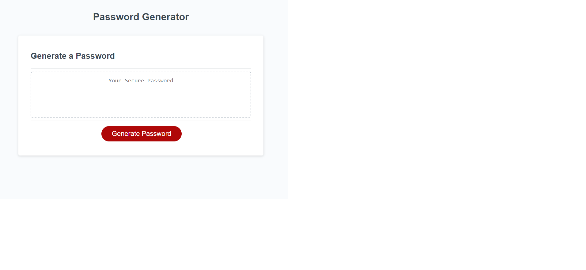

# Password Generator

### A basic password generator that creates a random string of characters based on choices asked of the user.

[A link to the deployed website on GitHub](https://ccatalyst.github.io/Password-generator/)



```
The generator works by asking the user a series of questions when they hit the "Generate Password" button below the text box in the center of the screen:

- the length of the desired passwords, between 8 and 128 characters
- If lowercase letters should be included
- If uppercase letters should be included
- If numbers should be included
- If special characters, such as "@" or "%" should be included.

Based on the choices given by the user, the characters are included in the generated password.
```
